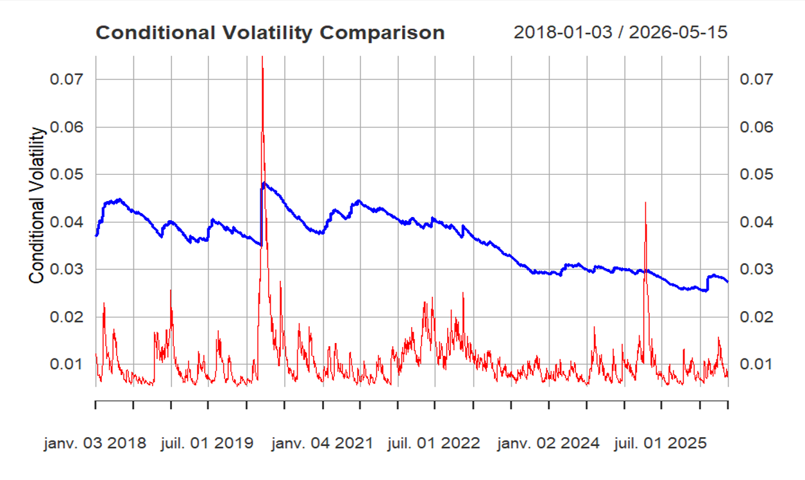

# Bitcoin vs. S&P 500: Time Series and Volatility Analysis

## Overview

This project investigates the return dynamics and volatility behaviour of Bitcoin and the S&P 500 using financial time series analysis. Developed for the **Time Series Analysis in Finance** course, the study applies econometric models to compare a cryptocurrency with a traditional equity market index.

The analysis uses daily closing-price data from Yahoo Finance and examines return stationarity, linear dependence, volatility clustering, and potential predictive relationships between the two markets.

## Research Question

**Do Bitcoin and the S&P 500 exhibit similar return dynamics and volatility patterns?**

## Data

* **Bitcoin:** BTC-USD
* **S&P 500:** ^GSPC
* **Source:** Yahoo Finance
* **Frequency:** Daily observations
* **Study period:** Beginning in January 2018; the analysis uses common trading dates for both series.

## Methodology

The analysis follows these main steps:

1. **Data preparation:** Retrieve closing prices, handle missing observations, and align the two time series on common dates.
2. **Log returns:** Transform prices into continuously compounded returns.
3. **Stationarity testing:** Apply the Augmented Dickey–Fuller (ADF) test.
4. **Autocorrelation analysis:** Examine the ACF and PACF.
5. **ARIMA modelling:** Model linear return dynamics and assess residual autocorrelation using the Ljung–Box test.
6. **GARCH(1,1) modelling:** Estimate conditional volatility and investigate volatility clustering and persistence.
7. **VAR and Granger causality:** Investigate whether past conditional volatility in one market provides predictive information about volatility in the other.

## Key Findings

The reported results indicate that:

* Both return series are stationary according to the ADF tests.
* Return series exhibit limited linear predictability.
* Both markets show volatility clustering and high volatility persistence.
* Bitcoin exhibits substantially higher and more persistent volatility than the S&P 500.
* VAR-based Granger causality tests indicate bidirectional predictive relationships between the estimated volatility series.

These findings describe the results reported in the project and depend on the sample period and model specifications.

## Volatility Comparison

The estimated conditional volatility series highlight the differences in volatility behaviour between Bitcoin and the S&P 500.

## Tools and Technologies

* **R**
* `quantmod` — financial data retrieval
* `tseries` — stationarity testing
* `forecast` — ARIMA modelling and residual diagnostics
* `rugarch` — GARCH modelling
* `vars` — VAR modelling and causality analysis

## Repository Contents

* `time_series_analysis.R` — R script containing the analysis workflow
* `Volatility in Bitcoin and the S&P 500.docx` — written project report
* `TSA Presentation.pptx` — project presentation

## Limitations and Future Work

The analysis uses univariate GARCH models to estimate each market's conditional volatility before investigating their relationship through a VAR framework. Future work could explore multivariate volatility models, such as DCC-GARCH, to model time-varying dependence more directly.

## Academic Context

Developed as part of the **Time Series Analysis in Finance** course. Presented on 22 May 2026.
